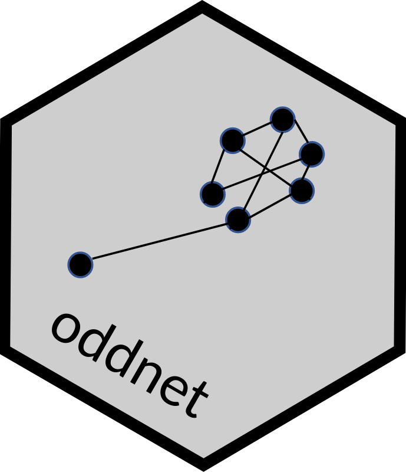

<!-- README.md is generated from README.Rmd. Please edit that file -->

# oddnet 

<!-- badges: start -->

[](https://github.com/sevvandi/oddnet/actions)
<!-- badges: end -->

The goal of oddnet is to identify anomalous networks from a series of
temporal networks.

## Installation

You can install the development version of oddnet from
[GitHub](https://github.com/) with:

``` r
# install.packages("devtools")
devtools::install_github("sevvandi/oddnet")
```

## Example

In this example we generate a series of networks and add an anomalous
network at location 50.

``` r
library(oddnet)
library(igraph)
#> 
#> Attaching package: 'igraph'
#> The following objects are masked from 'package:stats':
#> 
#>     decompose, spectrum
#> The following object is masked from 'package:base':
#> 
#>     union
set.seed(1)
networks <- list()
p.or.m.seq <- rep(0.05, 100)
p.or.m.seq[50] <- 0.2  # outlying network at 50
for(i in 1:100){
 gr <- igraph::erdos.renyi.game(100, p.or.m = p.or.m.seq[i])
 networks[[i]] <- igraph::as_adjacency_matrix(gr)
}
anom <- anomalous_networks(networks)
anom
#> Leave-out-out KDE outliers using lookout algorithm
#> 
#> Call: lookout::lookout(X = dfpca[, 1:dd], alpha = alpha)
#> 
#>   Outliers Probability
#> 1       50           0
```
